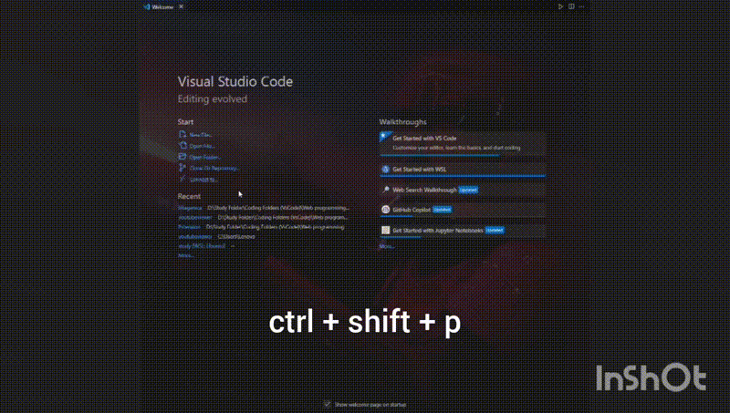

# Imagenica

Welcome to the **imagenica** extension for Visual Studio Code! This extension allows you to generate and view images based on prompts you provide, using an external API.

Made with 🧡 - [dev1abhi](https://github.com/dev1abhi)

## Features

- **Generate Images**: Enter a prompt to generate images through an API and view the results directly in your VS Code editor.
- **Multiple Images**: After generating the first image, the extension automatically requests and displays two more images with the same prompt.
- **Search Images**: You can search for  Unsplash images which are copyright free.

## Usage 
##### CTRL+SHIFT+P

##### Give a prompt

> Tip: Give more details in your prompt to get your desired image through the generator.

## Requirements

- No additional setup required.

## Extension Settings

This extension does not add any VS Code settings.

## Release Notes

### 1.0.0

- Initial release of the imagenica extension.

## Usage

1. **Install the Extension**: 
   - Open Visual Studio Code.
   - Go to the Extensions view by clicking the Extensions icon in the Sidebar or pressing `Ctrl+Shift+X`.
   - install .vsix from release section.
   - Click the three dots in the upper right corner.
   - choose install from .vsix
   - Voila!

2. **Generate Images**:
   - Open the Command Palette with `Ctrl+Shift+P` (Windows/Linux) or `Cmd+Shift+P` (macOS).
   - Type and select `imagenica.generateImages`.
   - Enter your image prompt in the input box that appears.
   - Wait while the extension generates and displays the first image. A loading animation will show while additional images are being generated.

3. **View Results**:
   - The extension will display the generated images in a  panel.
   - The panel will show the first image immediately, followed by additional images as they are generated.

## Author

This extension is maintained by [Abhilash Sarangi](https://github.com/dev1abhi).

**Enjoy using imagenica!**
